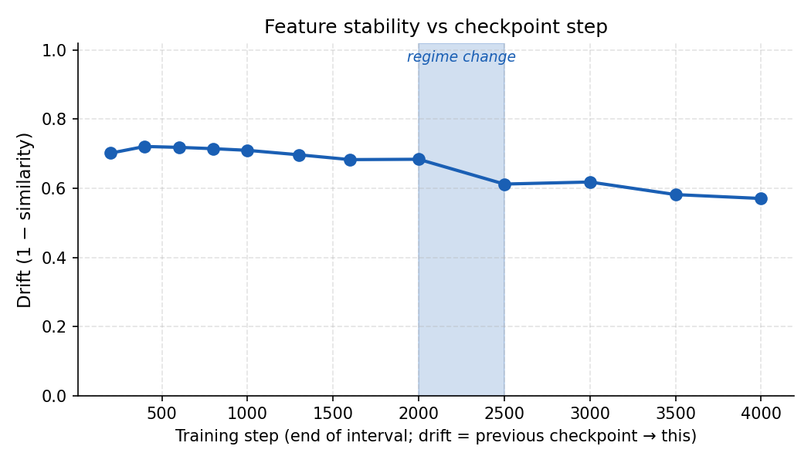

# Mechanistic interpretability

## Motivation

**What I'm interested in.** I want to understand how neural networks actually work: what algorithms they learn and where those live in the weights and activations. It's the kind of mechanism-level question that shows up in physics when you care about explaining behaviour from first principles instead of treating the system as a black box.

**Vision.** I believe there is a fundamental, general theory that can explain neural networks, and that we could use it to *build* networks instead of only training on data without really knowing how learning happens. In physics, we already have classical and quantum mechanics: they tell us how physical systems behave, and we design and build systems on the basis of those laws. I'm excited by the possibility of something analogous for neural networks.

**How my past research connects.** I've done fundamental research on heat transfer and phonons in atomic systems. In condensed matter, you're trying to understand patterns, collective behaviour, and how systems respond to perturbations. I see a strong parallel with mechanistic interpretability: same desire to open the black box and understand what's going on underneath. That's the kind of understanding I think we need if we want systems that are reliable, safe, and aligned.

For some of my past research, see my [Google Scholar](https://scholar.google.com/citations?user=HJJ7NTUAAAAJ&hl=en).

## Projects

With that motivation in mind, I've started exploring the current state of research in mechanistic interpretability and sharing some of these initial explorations here.

### logit_lens_patching

**Logit lens & activation patching** on a language model (TransformerLens + GPT-2 Small): when and where a model's prediction forms, and which layers matter for it.

- [README](logit_lens_patching/README.md)
- [Notebook](logit_lens_patching/logit_lens_and_patching.ipynb)

### sae_feature_emergence

**SAE feature emergence:** when and how SAE-discovered features stabilize during training, and whether they causally contribute.

*Drift (1 − mean cosine similarity of matched feature directions) between consecutive checkpoints. Regime change around ~2k steps; directions stabilize afterward. Generate with `make sae-plots`.*

**What we did**
- Train a small transformer; at each checkpoint, train the same SAE on one layer’s residual stream.
- Measure **drift** (1 − mean cosine similarity of matched feature directions) across consecutive checkpoint pairs.
- Validate with **top-k ablation** (zero top-k feature contributions, measure ΔCE) and **random-k** control.
- Show **max-activating examples** (which token/context makes each feature fire).

**Findings**
- **Regime change:** Drift is high and roughly flat until ~2k steps, then **drops sharply** and **plateaus** at a lower level (~0.57–0.61). Feature directions stabilize after that point.
- **Causal:** Top-k ablation increases loss (ΔCE > 0); random-k has no effect → the model relies on those features.
- **Interpretable:** Some features are token detectors (e.g. one fires on comma); others sparse (synthetic data).

**Limitations**
- One model size, one layer, one SAE config; synthetic data.
- Results may not generalize to larger models, other layers, or real data.

**Links and run**
- [README](sae_feature_emergence/README.md)
- [Findings notebook](sae_feature_emergence/findings.ipynb)
- **Run from repo root:** `make help` for targets; `make sae-all` for the full pipeline (uses `uv`).
